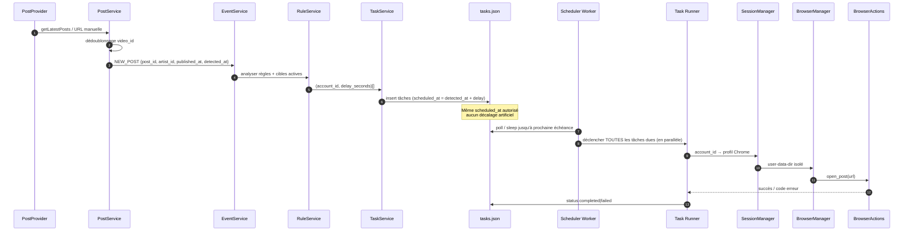
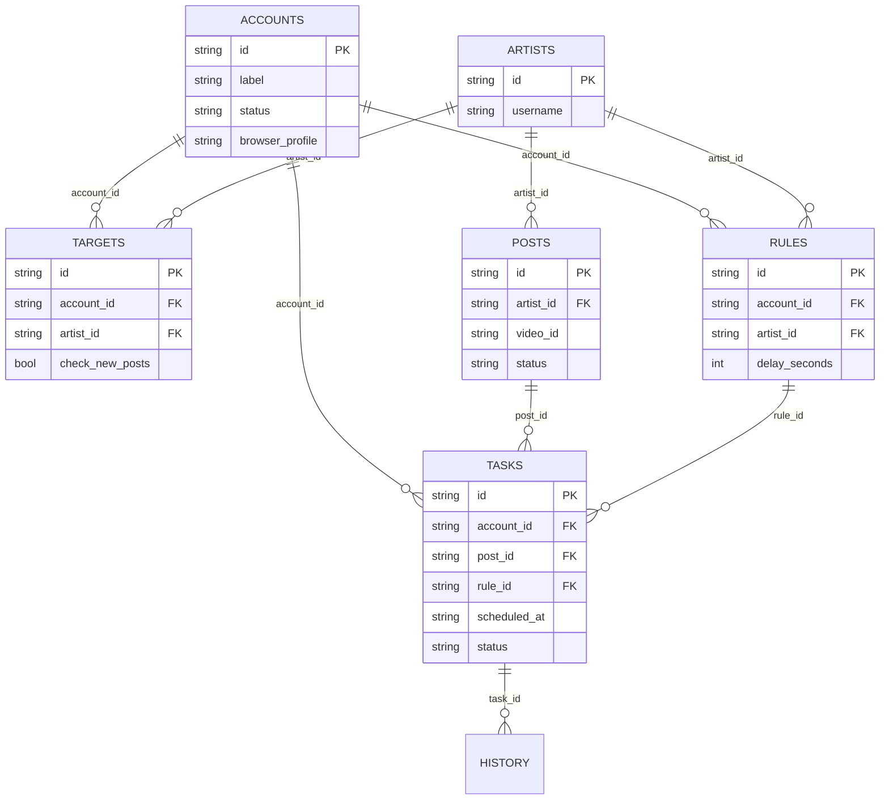

# Architecture — TikTok Multi-Account Manager (V1)

**Statut :** proposition d’architecture — validation en cours, pas encore de code applicatif.

Ce document répond aux 15 livrables demandés. Il ne contient pas l’implémentation.

### Décisions déjà validées

| # | Sujet | Décision |
| --- | --- | --- |
| 2 | Warmup Chrome | **OK.** `browser_warmup_seconds` (défaut 8). `scheduled_at` inchangé. |
| 3 | Détection V1 | **Option B.** Poller Selenium des profils artistes (pas seulement l’ajout manuel). |

---

## 0. Principes non négociables

1. Plateforme **multi-comptes** : le nombre de comptes est dynamique, jamais codé en dur.
2. Aucun état global `currentAccount`. Chaque opération porte un `account_id`.
3. Chaque compte a un **profil Chrome isolé** et une session indépendante.
4. Les délais sont en **secondes** (éventuellement fractionnaires côté horodatage).
5. Plusieurs tâches peuvent partager le même `scheduled_at` ; le scheduler **ne les décale pas**.
6. Une erreur sur un compte n’interrompt jamais les autres.
7. Stockage V1 = JSON + abstraction `StorageInterface` (SQLite / MySQL / PostgreSQL plus tard).
8. Selenium est un **processus Python indépendant** du PHP.
9. Les identifiants métier (`account_id`, `artist_id`, …) sont opaques. « Account 01 » n’est qu’un label.
10. Pas de mots de passe TikTok en clair. Préférer les mécanismes d’autorisation officiels lorsqu’ils existent.

---

## 1. Arborescence finale du projet

L’arborescence du cahier des charges est conservée. Quelques fichiers sont **ajoutés** (justifiés) pour que l’architecture tienne : bootstrap API, interface de stockage, événements, auth dashboard, fiche compte, protection des répertoires sensibles, contrat de verrouillage PHP/Python.

```text
tiktok-manager/
├── index.php                      # Dashboard
├── login.php
├── logout.php
├── accounts.php                   # Liste + actions comptes
├── account.php                    # Fiche détaillée d’un compte (?id=)
├── artists.php
├── targets.php
├── posts.php
├── rules.php
├── tasks.php                      # Supervision temps réel
├── history.php
├── stats.php
├── settings.php
├── logs.php                       # Lecture filtrée des journaux applicatifs
│
├── assets/
│   ├── css/
│   │   ├── style.css              # Layout, sidebar, thème sombre, responsive
│   │   └── dashboard.css          # Cartes, grilles, badges d’état
│   ├── js/
│   │   ├── app.js                 # Auth fetch, CSRF, navigation, toasts
│   │   ├── dashboard.js           # Polling dashboard
│   │   ├── accounts.js
│   │   ├── artists.js
│   │   ├── targets.js
│   │   ├── posts.js
│   │   ├── rules.js
│   │   ├── tasks.js
│   │   ├── history.js
│   │   └── settings.js
│   └── img/
│
├── api/
│   ├── bootstrap.php              # Session, CSRF, JSON I/O, dispatch méthode
│   ├── accounts.php
│   ├── artists.php
│   ├── targets.php
│   ├── posts.php
│   ├── rules.php
│   ├── tasks.php
│   ├── history.php
│   ├── stats.php
│   ├── settings.php
│   ├── events.php                 # Lecture des événements internes
│   ├── simulate.php               # DEV_MODE uniquement
│   └── logs.php                   # Tail sécurisé des logs (auth requise)
│
├── includes/
│   ├── config.php
│   ├── bootstrap.php              # Autoload / require des services
│   ├── security.php
│   ├── helpers.php
│   ├── logger.php
│   ├── response.php               # Envelope {success, data, error}
│   ├── StorageInterface.php       # Abstraction migration future
│   ├── JsonStorage.php            # Implémentation V1 (flock + write atomique)
│   └── providers/
│       ├── PostProvider.php       # Interface
│       ├── ManualPostProvider.php
│       ├── OfficialApiPostProvider.php
│       ├── ImportPostProvider.php
│       ├── SeleniumWatchPostProvider.php  # Ingest des posts vus par le poller
│       └── SimulationPostProvider.php
│
├── services/
│   ├── AccountService.php
│   ├── ArtistService.php
│   ├── TargetService.php
│   ├── PostService.php
│   ├── RuleService.php
│   ├── TaskService.php
│   ├── EventService.php           # Bus interne (NEW_POST, …)
│   ├── SchedulerService.php       # Côté PHP : heartbeat, armement, statut worker
│   ├── TikTokService.php          # URLs, video_id, normalisation username
│   ├── HistoryService.php
│   ├── StatsService.php
│   ├── SettingsService.php
│   ├── BackupService.php
│   └── SimulationService.php
│
├── data/                          # INTERDIT en HTTP (Deny from all)
│   ├── .htaccess
│   ├── accounts.json
│   ├── artists.json
│   ├── targets.json
│   ├── posts.json
│   ├── rules.json
│   ├── tasks.json
│   ├── history.json
│   ├── events.json
│   ├── stats.json
│   ├── settings.json
│   ├── users.json                 # Auth dashboard (hash, pas de secret TikTok)
│   ├── worker_state.json          # Heartbeat du worker Python
│   ├── watcher_state.json         # Cycle de surveillance artistes
│   └── backups/
│       └── .htaccess
│
├── worker/
│   ├── scheduler_worker.py        # Boucle persistante à la seconde
│   ├── queue_manager.py           # File globale = tasks.json
│   ├── json_store.py              # Verrouillage compatible PHP flock
│   ├── task_runner.py             # Exécute UNE tâche, isole les erreurs
│   ├── worker_state.py
│   └── watch_loop.py              # Poller artistes — profil Chrome _watcher
│
├── selenium/
│   ├── runner.py                  # Point d’entrée CLI (une tâche / une action)
│   ├── browser_manager.py
│   ├── session_manager.py
│   ├── actions.py                 # Seule couche autorisée à parler au DOM
│   ├── errors.py                  # Codes d’erreur stables
│   ├── logger.py
│   ├── requirements.txt
│   ├── profiles/                  # INTERDIT en HTTP — un dossier par account_id
│   │   ├── _watcher/              # Session dédiée à la détection (pas un compte géré)
│   │   └── .htaccess
│   └── logs/
│       └── .htaccess
│
├── logs/                          # INTERDIT en HTTP
│   ├── .htaccess
│   ├── application.log
│   ├── scheduler.log
│   └── errors.log
│
├── tests/
│   ├── php/                       # Scénarios métier (NEW_POST, doublons, délais)
│   └── python/                    # Scheduler : même timestamp, restart, erreurs
│
├── .htaccess                      # Front controller léger + deny data/logs/profiles
├── composer.json                  # Optionnel V1 (autoload PSR-4 si retenu)
├── ARCHITECTURE.md                # Ce document
└── README.md
```

### Fichiers ajoutés par rapport au CDC — justification

| Fichier | Pourquoi |
| --- | --- |
| `api/bootstrap.php` | PUT/DELETE PHP, CSRF, envelope JSON unique |
| `StorageInterface.php` | Migration SQLite/MySQL/PostgreSQL sans réécrire les services |
| `TargetService.php` | Associations account↔artist absentes des services listés |
| `EventService.php` | Événement `NEW_POST` explicite et journalisé |
| `events.json` / `users.json` / `worker_state.json` | Bus d’événements, auth, reprise worker |
| `account.php`, `logs.php` | Fiche compte et supervision demandées |
| `json_store.py` | Même protocole de lock que PHP (`flock` / `fcntl`) |
| `task_runner.py` | Isolation d’erreur par tâche, hors Selenium |
| `watch_loop.py` + `profiles/_watcher/` | Détection auto option B, isolée des comptes gérés |

---

## 2. Diagramme de l’architecture

### 2.1 Vue d’ensemble

```text
┌─────────────────────────────────────────────────────────────────┐
│  Navigateur opérateur (HTML/CSS/JS vanilla)                     │
│  Dashboard · Comptes · Artistes · Cibles · Posts · Règles       │
│  Tâches · Historique · Stats · Paramètres                       │
└──────────────────────────────┬──────────────────────────────────┘
                               │ fetch / AJAX  (+ cookie session)
                               ▼
┌─────────────────────────────────────────────────────────────────┐
│  API PHP 8+  (api/*.php)                                        │
│  Auth dashboard · CSRF · validation · envelope JSON             │
└──────────────────────────────┬──────────────────────────────────┘
                               │
                               ▼
┌─────────────────────────────────────────────────────────────────┐
│  Services métier                                                │
│  Account · Artist · Target · Post · Rule · Task · Event         │
│  History · Stats · Settings · Backup · TikTok (URLs)            │
│  Providers de posts (Selenium watch / manuel / import / officiel / simulation)   │
└──────────────────────────────┬──────────────────────────────────┘
                               │ StorageInterface
                               ▼
┌─────────────────────────────────────────────────────────────────┐
│  JsonStorage  (flock + fichier .lock + write atomique)          │
│  data/*.json  ·  data/backups/                                  │
└──────────────────────────────┬──────────────────────────────────┘
                               │ lecture / MAJ tâches + heartbeat
                               ▼
┌─────────────────────────────────────────────────────────────────┐
│  Worker Python persistant                                       │
│  scheduler_worker.py → queue_manager.py → task_runner.py        │
│                    ↳ watch_loop.py (profil _watcher)            │
└──────────────────────────────┬──────────────────────────────────┘
                               │ subprocess / module local
                               ▼
┌─────────────────────────────────────────────────────────────────┐
│  Module Selenium indépendant                                    │
│  runner.py → SessionManager → BrowserManager → BrowserActions   │
└──────────────────────────────┬──────────────────────────────────┘
                               │ user-data-dir unique
                               ▼
┌──────────────┐  ┌──────────────┐  ┌──────────────┐  ┌──────────────┐
│ Chrome       │  │ Chrome       │  │ Chrome       │  │ Chrome       │
│ _watcher     │  │ account_aaa  │  │ account_bbb  │  │ account_nnn  │
│ Détection    │  │ Session TT 1 │  │ Session TT 2 │  │ Session TT N │
└──────────────┘  └──────────────┘  └──────────────┘  └──────────────┘
```

### 2.2 Flux métier central



---

## 3. Rôle précis de chaque composant

### 3.1 Couche interface

| Composant | Rôle |
| --- | --- |
| Pages PHP racine | Rendu HTML du shell (sidebar, layout). Les données viennent ensuite de l’API via `fetch`. |
| `assets/css` | Thème sombre SaaS, responsive, badges d’état. |
| `assets/js/app.js` | Helpers HTTP, CSRF, toasts, formatage dates. |
| `dashboard.js` | Polling (ex. 1 s) : comptes, posts, tâches, erreurs, activité. |
| `tasks.js` | Tableau de supervision + compte à rebours `scheduled_at - now`. |
| `rules.js` | Tableau de délais groupés + « Enregistrer les délais ». |

### 3.2 Couche API PHP

Chaque fichier `api/*.php` :

1. charge `bootstrap.php` (session opérateur, CSRF, méthode HTTP) ;
2. délègue au service ;
3. répond uniquement avec l’envelope §40.

Aucun fichier API n’accède aux JSON directement.

### 3.3 Services métier

Voir §7. Ils encapsulent les invariants (unicité, délais, `NEW_POST`, pas de `currentAccount`).

### 3.4 Stockage

`StorageInterface` + `JsonStorage` : seule porte d’entrée vers `data/`. `BackupService` copie avant les écritures critiques.

### 3.5 Worker

Processus long-lived. Source de vérité = `tasks.json`. Ne recalcule **jamais** un `scheduled_at`.

### 3.6 Selenium

Boîte noire CLI. PHP et le worker ne connaissent que :

```text
python selenium/runner.py --account-id … --action open_post --url …
```

Les sélecteurs DOM restent dans `actions.py`.

---

## 4. Schéma complet de chaque fichier JSON

Convention commune :

- Encodage UTF-8, pretty-print optionnel en `DEV_MODE`.
- Horodatages **ISO-8601 UTC avec millisecondes** : `2026-08-16T18:42:10.000Z`.
- Identifiants : préfixe + entropy, ex. `account_9f8c72`. Jamais un index visuel.
- Envelope fichier :

```json
{
  "version": 1,
  "updated_at": "2026-08-16T18:42:10.000Z",
  "items": []
}
```

Exception : `settings.json` et `worker_state.json` sont des documents uniques (pas de liste `items`).

### 4.1 `accounts.json`

```json
{
  "version": 1,
  "updated_at": "",
  "items": [
    {
      "id": "account_9f8c72",
      "label": "Account 01",
      "username": "@username",
      "profile_url": "https://www.tiktok.com/@username",
      "enabled": true,
      "status": "idle",
      "browser_profile": "account_9f8c72",
      "session_status": "unknown",
      "session_checked_at": null,
      "created_at": "",
      "updated_at": "",
      "last_activity": null,
      "notes": "",
      "error_code": null,
      "error_message": null
    }
  ]
}
```

| Champ | Contraintes |
| --- | --- |
| `id` | Unique, immuable. `browser_profile` = même valeur par défaut. |
| `status` | `idle` \| `busy` \| `offline` \| `disabled` \| `session_expired` \| `error` |
| `session_status` | `connected` \| `expired` \| `reauthentication_required` \| `unknown` |
| Secrets | **Aucun** mot de passe, cookie, token TikTok. |

### 4.2 `artists.json`

```json
{
  "version": 1,
  "updated_at": "",
  "items": [
    {
      "id": "artist_001",
      "name": "Nom artiste",
      "username": "@username",
      "tiktok_url": "https://www.tiktok.com/@username",
      "category": "reggaeton",
      "country": "",
      "priority": 1,
      "enabled": true,
      "created_at": "",
      "updated_at": ""
    }
  ]
}
```

Unicité recommandée : `username` normalisé (minuscule, avec `@`).

### 4.3 `targets.json`

Association N–N compte ↔ artiste.

```json
{
  "version": 1,
  "updated_at": "",
  "items": [
    {
      "id": "target_001",
      "account_id": "account_9f8c72",
      "artist_id": "artist_001",
      "enabled": true,
      "check_new_posts": true,
      "created_at": "",
      "updated_at": ""
    }
  ]
}
```

Unicité : couple `(account_id, artist_id)`.

### 4.4 `posts.json`

```json
{
  "version": 1,
  "updated_at": "",
  "items": [
    {
      "id": "post_58329",
      "artist_id": "artist_001",
      "username": "@username",
      "url": "https://www.tiktok.com/@username/video/1234567890",
      "video_id": "1234567890",
      "caption": "",
      "published_at": "2026-08-16T18:42:10.000Z",
      "detected_at": "2026-08-16T18:42:10.000Z",
      "status": "new",
      "source": "manual",
      "provider": "manual"
    }
  ]
}
```

| Champ | Contraintes |
| --- | --- |
| `status` | `new` \| `queued` \| `processed` \| `ignored` |
| `source` | `official_api` \| `manual` \| `import` \| `selenium_watch` \| `simulation` |
| Unicité | `video_id` s’il est connu, sinon URL normalisée |

### 4.5 `rules.json`

Comportement **par couple** compte × artiste.

```json
{
  "version": 1,
  "updated_at": "",
  "items": [
    {
      "id": "rule_001",
      "account_id": "account_9f8c72",
      "artist_id": "artist_001",
      "enabled": true,
      "delay_seconds": 2,
      "priority": 10,
      "created_at": "",
      "updated_at": ""
    }
  ]
}
```

| Champ | Contraintes |
| --- | --- |
| `delay_seconds` | Nombre ≥ 0, **pas** limité aux minutes. Entier en V1 ; float accepté si besoin (ex. `1.5`). |
| Unicité | `(account_id, artist_id)` — une règle active par couple. |
| `priority` | Ordre d’affichage / tie-break UI uniquement. **Ne change pas** `scheduled_at`. |

### 4.6 `tasks.json` — file globale

```json
{
  "version": 1,
  "updated_at": "",
  "items": [
    {
      "id": "task_001",
      "account_id": "account_9f8c72",
      "post_id": "post_58329",
      "rule_id": "rule_001",
      "created_at": "2026-08-16T18:42:10.180Z",
      "scheduled_at": "2026-08-16T18:42:12.000Z",
      "started_at": null,
      "completed_at": null,
      "status": "pending",
      "attempts": 0,
      "last_error": null,
      "error_code": null
    }
  ]
}
```

| Champ | Contraintes |
| --- | --- |
| `status` | `pending` \| `ready` \| `running` \| `completed` \| `failed` \| `cancelled` |
| Unicité métier | `(post_id, account_id)` pour une génération donnée (idempotence `NEW_POST`) |
| `scheduled_at` | Calculé une fois, **immuable** ensuite |

### 4.7 `history.json`

Journal append-only (les mises à jour d’un item sont interdites ; on ajoute une ligne).

```json
{
  "version": 1,
  "updated_at": "",
  "items": [
    {
      "id": "history_001",
      "task_id": "task_001",
      "account_id": "account_9f8c72",
      "post_id": "post_58329",
      "event": "post_opened",
      "status": "success",
      "created_at": "2026-08-16T18:42:12.650Z",
      "duration_ms": 648,
      "details": {}
    }
  ]
}
```

Événements typiques : `new_post`, `task_created`, `task_started`, `browser_started`, `post_opened`, `task_completed`, `task_failed`, `session_expired`, `worker_restart`.

### 4.8 `events.json`

Bus interne persistant (complète l’historique opérationnel).

```json
{
  "version": 1,
  "updated_at": "",
  "items": [
    {
      "id": "event_001",
      "type": "NEW_POST",
      "payload": {
        "post_id": "post_58329",
        "artist_id": "artist_001",
        "published_at": "2026-08-16T18:42:10.000Z",
        "detected_at": "2026-08-16T18:42:10.000Z"
      },
      "created_at": "2026-08-16T18:42:10.125Z",
      "processed": true,
      "processed_at": "2026-08-16T18:42:10.180Z"
    }
  ]
}
```

### 4.9 `stats.json`

```json
{
  "version": 1,
  "updated_at": "",
  "totals": {
    "accounts": 0,
    "accounts_enabled": 0,
    "artists": 0,
    "posts_detected": 0,
    "tasks_generated": 0,
    "tasks_completed": 0,
    "tasks_failed": 0,
    "errors": 0,
    "avg_execution_ms": 0
  },
  "per_account": {
    "account_9f8c72": {
      "operations": 0,
      "completed": 0,
      "failed": 0,
      "avg_execution_ms": 0
    }
  }
}
```

Recalculable à tout moment depuis `tasks` + `history` (source de vérité). `stats.json` est un cache.

### 4.10 `settings.json`

```json
{
  "version": 1,
  "updated_at": "",
  "scheduler_enabled": true,
  "selenium_enabled": true,
  "python_path": "python3",
  "chrome_path": "",
  "chromedriver_path": "",
  "watch_interval_seconds": 15,
  "watch_enabled": true,
  "watcher_profile": "_watcher",
  "watch_posts_limit": 8,
  "browser_timeout_seconds": 30,
  "browser_warmup_seconds": 8,
  "verbose_logs": true,
  "dev_mode": false,
  "timezone": "UTC",
  "dashboard_poll_ms": 1000,
  "worker_poll_ms": 100,
  "stale_running_timeout_seconds": 120,
  "backup_keep": 50
}
```

**Pas** de `MAX_CONCURRENT_BROWSERS` comme règle fonctionnelle. `browser_warmup_seconds` prépare le navigateur **avant** `scheduled_at` sans modifier l’échéance.

### 4.11 `users.json` (auth dashboard)

```json
{
  "version": 1,
  "updated_at": "",
  "items": [
    {
      "id": "user_001",
      "username": "admin",
      "password_hash": "$2y$12$...",
      "created_at": "",
      "last_login_at": null
    }
  ]
}
```

Uniquement des hashes PHP `password_hash`. Jamais de credentials TikTok.

### 4.12 `worker_state.json`

```json
{
  "version": 1,
  "pid": 12345,
  "started_at": "",
  "heartbeat_at": "",
  "status": "running",
  "next_due_at": null,
  "last_error": null
}
```

---

## 5. Relations entre `accounts`, `artists`, `targets`, `posts`, `rules` et `tasks`



### Règles d’intégrité

1. **Target** = « ce compte surveille cet artiste ».
2. **Rule** = « si une publication de cet artiste arrive, ce compte attend N secondes ».
3. Génération de tâches **si et seulement si** :
   - le post est nouveau (pas un doublon) ;
   - l’artiste est `enabled` ;
   - le compte est `enabled` et non `disabled` ;
   - il existe un `target` `(account_id, artist_id)` `enabled` avec `check_new_posts = true` ;
   - il existe une `rule` `(account_id, artist_id)` `enabled`.
4. Un artiste sans target → aucune tâche.
5. Un target sans rule → **aucune tâche** (pas de délai implicite). L’UI devra signaler les targets orphelins.
6. Un compte peut avoir N artistes ; un artiste peut être lié à N comptes.
7. `Account 01` n’apparaît nulle part comme clé.

### Exemple du CDC (§53)

`detected_at = 18:42:10.000` + 5 règles → 5 tâches indépendantes :

| Compte (label) | delay_seconds | scheduled_at |
| --- | ---: | --- |
| Account 01 | 2 | 18:42:12.000 |
| Account 02 | 4 | 18:42:14.000 |
| Account 03 | 5 | 18:42:15.000 |
| Account 04 | 8 | 18:42:18.000 |
| Account 05 | 15 | 18:42:25.000 |

Si deux comptes ont `delay_seconds = 5`, les deux tâches ont `scheduled_at = 18:42:15.000`.

---

## 6. Endpoints PHP nécessaires

Convention :

- Fichiers physiques `api/{resource}.php` (comme demandé).
- Méthode HTTP réelle + paramètre `id` en query pour GET/PUT/DELETE d’un item.
- Body JSON pour POST/PUT.
- Header `X-CSRF-Token` (session dashboard).
- Envelope unique §40.

Si le serveur ne transmet pas PUT/DELETE, `bootstrap.php` accepte `X-HTTP-Method-Override` ou `_method` dans le JSON — **sans** changer le contrat public.

### 6.1 Auth

| Méthode | Endpoint | Description |
| --- | --- | --- |
| POST | `/api/login` via `login.php` (form) | Session PHP |
| POST | `/logout.php` | Destruction session |
| GET | `/api/settings.php?resource=me` | Opérateur courant (pas de secret) |

### 6.2 Accounts

| Méthode | Endpoint | Description |
| --- | --- | --- |
| GET | `/api/accounts.php` | Liste (filtres : `status`, `enabled`, `session_status`) |
| GET | `/api/accounts.php?id=` | Détail + agrégats (cibles, règles, tâches) |
| POST | `/api/accounts.php` | Création (id généré, profil Chrome créé à la 1re session) |
| PUT | `/api/accounts.php?id=` | Modification label, notes, enabled, username |
| DELETE | `/api/accounts.php?id=` | Suppression (refuse si tâches `running`) |
| POST | `/api/accounts.php?id=&action=enable` | Activer |
| POST | `/api/accounts.php?id=&action=disable` | Désactiver |
| POST | `/api/accounts.php?id=&action=test_session` | Test session (enqueue action Selenium `check_session`) |
| POST | `/api/accounts.php?id=&action=open_tiktok` | Ouvrir TikTok dans le profil du compte |

Les actions « voir cibles / règles / tâches / historique » sont des GET filtrés sur les autres ressources (`?account_id=`).

### 6.3 Artists

| Méthode | Endpoint | Description |
| --- | --- | --- |
| GET | `/api/artists.php` | Liste |
| GET | `/api/artists.php?id=` | Détail |
| POST | `/api/artists.php` | Création |
| PUT | `/api/artists.php?id=` | Modification |
| DELETE | `/api/artists.php?id=` | Suppression (cibles + règles liées) |

### 6.4 Targets

| Méthode | Endpoint | Description |
| --- | --- | --- |
| GET | `/api/targets.php` | Liste (`account_id`, `artist_id`) |
| POST | `/api/targets.php` | Association |
| PUT | `/api/targets.php?id=` | enable / `check_new_posts` |
| DELETE | `/api/targets.php?id=` | Dissociation |

### 6.5 Posts

| Méthode | Endpoint | Description |
| --- | --- | --- |
| GET | `/api/posts.php` | Liste (filtres status, artist_id) |
| GET | `/api/posts.php?id=` | Détail |
| POST | `/api/posts.php` | Ajout manuel d’URL → validation → `NEW_POST` si inédit |
| POST | `/api/posts.php?action=detect` | Déclenche les providers (watch) |
| PUT | `/api/posts.php?id=` | `ignored` / `processed` manuel |

### 6.6 Rules

| Méthode | Endpoint | Description |
| --- | --- | --- |
| GET | `/api/rules.php` | Liste (`account_id`, `artist_id`) |
| POST | `/api/rules.php` | Création |
| PUT | `/api/rules.php?id=` | MAJ délai / enabled / priority |
| PUT | `/api/rules.php?action=bulk_delays` | Tableau « Enregistrer les délais » |
| DELETE | `/api/rules.php?id=` | Suppression |

Body bulk :

```json
{
  "items": [
    { "id": "rule_001", "delay_seconds": 2, "enabled": true }
  ]
}
```

### 6.7 Tasks

| Méthode | Endpoint | Description |
| --- | --- | --- |
| GET | `/api/tasks.php` | File (filtres status, account_id, from/to) |
| GET | `/api/tasks.php?id=` | Détail |
| GET | `/api/tasks.php?view=supervision` | Vue HEURE / COMPTE / CIBLE / ÉTAT + countdowns |
| POST | `/api/tasks.php?id=&action=cancel` | Annulation si non terminée |
| POST | `/api/tasks.php?id=&action=retry` | Nouvelle tentative (nouvel `id` ou `attempts++`, **même** `scheduled_at` ou `now` selon flag) |

Pas de POST de création manuelle hors `NEW_POST` / simulation : le générateur reste la source.

### 6.8 History / Stats / Settings / Events / Logs / Simulate

| Méthode | Endpoint | Description |
| --- | --- | --- |
| GET | `/api/history.php` | Journal filtré |
| GET | `/api/stats.php` | Totaux + per_account |
| GET | `/api/settings.php` | Configuration |
| PUT | `/api/settings.php` | MAJ |
| GET | `/api/events.php` | Événements internes |
| GET | `/api/logs.php` | Tail `application` / `scheduler` / `errors` (auth, pas de cookies Chrome) |
| POST | `/api/simulate.php` | DEV_MODE : NEW_POST, 10 comptes, session expirée, etc. |

### 6.9 Envelope

Succès :

```json
{ "success": true, "data": {}, "error": null }
```

Erreur :

```json
{
  "success": false,
  "data": null,
  "error": { "code": "ACCOUNT_NOT_FOUND", "message": "Account not found" }
}
```

Listes : `data: { "items": [], "count": 0 }`.

---

## 7. Classes PHP et responsabilités

### 7.1 Infrastructure

| Classe | Responsabilité |
| --- | --- |
| `Config` | Chemins, `DEV_MODE`, timezone. Lecture de `settings.json` en cache mémoire requête. |
| `StorageInterface` | `read`, `write`, `find`, `findById`, `insert`, `update`, `delete`. |
| `JsonStorage` | Fichiers JSON, lock exclusif, write atomique, index par `id`. |
| `Logger` | `application.log` / `errors.log`, format horodaté ms. |
| `Security` | Session dashboard, CSRF, rate-limit login, refuse l’accès HTTP à `data/`, `logs/`, `selenium/profiles/`. |
| `ApiResponse` | Envelope, codes HTTP 200/400/401/404/409/500. |
| `Helpers` | IDs, UTC ms, normalisation `@username`, comparaison d’URL. |
| `BackupService` | Snapshot `data/*.json` → `data/backups/`, rotation `backup_keep`. |

### 7.2 Métier

| Classe | Responsabilité |
| --- | --- |
| `AccountService` | CRUD dynamique, transitions `status`, jamais de limite N, création du nom de profil = `id`. |
| `ArtistService` | Bibliothèque d’artistes. |
| `TargetService` | Associations N–N, unicité du couple. |
| `TikTokService` | Valider URL TikTok, extraire `video_id` / username, construire `profile_url`. |
| `PostService` | Ingestion (manuel, providers), dédoublonnage, passage `new` → événement. |
| `EventService` | Persiste et dispatch `NEW_POST` (et futurs types). Synchrone en V1. |
| `RuleService` | CRUD + bulk delays ; sélection des règles applicables à un `artist_id`. |
| `TaskService` | Génère les tâches depuis un événement ; **ne modifie pas** les horaires demandés ; accepte les collisions d’échéance. |
| `SchedulerService` | Lit/écrit `worker_state.json` ; n’exécute pas les tâches (Python). |
| `HistoryService` | Append-only + filtres. |
| `StatsService` | Agrégats dashboard (recalcul ou incrément). |
| `SettingsService` | Paramètres système. |
| `SimulationService` | DEV_MODE : scénarios sans TikTok. |

### 7.3 Providers

```php
interface PostProvider
{
    public function getName(): string;
    public function getLatestPosts(string $username): array;
}
```

| Classe | Rôle |
| --- | --- |
| `OfficialApiPostProvider` | Uniquement endpoints / tokens **officiels** TikTok si configurés. Stub si non configuré. |
| `ManualPostProvider` | URL collée par l’opérateur. |
| `ImportPostProvider` | Import fichier / liste d’URLs. |
| `SimulationPostProvider` | `DEV_MODE`. |

Le système ne dépend d’aucune source unique. **Aucun provider V1 ne doit reposer sur du scraping non officiel** comme chemin principal de détection.

### 7.4 Invariants dans le code

- Signature de toute opération navigateur / tâche : `(account_id, …)`.
- Interdiction d’une variable globale de compte courant.
- `TaskService::createFromNewPost()` : `scheduled_at = detected_at + delay_seconds` (addition arithmétique, pas d’arrondi à la minute, pas de jitter).

---

## 8. Modules Python et responsabilités

### 8.1 Worker

| Module | Responsabilité |
| --- | --- |
| `scheduler_worker.py` | Boucle infinie, précision ~100 ms, dispatch parallèle des tâches dues. |
| `queue_manager.py` | Lecture filtrée de `tasks.json`, transitions `pending→ready→running→…`. |
| `json_store.py` | `fcntl.flock` sur `{file}.lock` + rename atomique — **même protocole que PHP**. |
| `task_runner.py` | Exécute **une** tâche dans un `try/except` isolé ; met à jour compte / history / stats. |
| `worker_state.py` | Heartbeat PID, `next_due_at`. |

### 8.2 Selenium (indépendant)

| Module | Responsabilité |
| --- | --- |
| `runner.py` | CLI : `check_session`, `open_url`, `open_profile`, `open_post`. Sortie JSON stdout. |
| `session_manager.py` | `account_id` → chemin `selenium/profiles/{browser_profile}/`. Refuse un profil qui ne correspond pas. Statuts session. |
| `browser_manager.py` | Démarrer / fermer Chromium, `user-data-dir`, isolation cookies/cache, logs, erreurs navigateur. |
| `actions.py` | Unique endroit des actions autorisées (ouvrir URL / profil / post, lire l’URL courante, check session, close). |
| `errors.py` | Codes §38. |
| `logger.py` | `selenium/logs/` + relais vers `logs/scheduler.log`. |

Contrat `BrowserActions` (implémenté dans `actions.py`) :

```python
class BrowserActions:
    def open_url(self, url: str) -> None: ...
    def open_profile(self, username: str) -> None: ...
    def open_post(self, url: str) -> None: ...
    def check_session(self) -> str: ...  # connected | expired | ...
    def get_current_url(self) -> str: ...
    def close(self) -> None: ...
```

Le worker n’importe pas Selenium. Il spawn `runner.py`. Ainsi PHP, worker et navigateur restent découplés.

---

## 9. Fonctionnement détaillé du worker

### 9.1 Pourquoi un processus persistant

Un cron à la minute rate toutes les échéances intra-minute (`+2 s`, `+5 s`). Le worker reste en mémoire et dort jusqu’à la **prochaine** échéance (granularité `worker_poll_ms`, défaut 100 ms).

### 9.2 Boucle

```text
au démarrage:
  1. lock worker (pid file) — un seul worker
  2. réconcilier les tâches running orphelines (voir §14)
  3. heartbeat running

tant que vivant:
  4. si settings.scheduler_enabled == false → sleep, heartbeat idle, continue
  5. charger tasks status ∈ {pending, ready}
  6. pending dont scheduled_at <= now → ready (changement d’état seulement)
  7. due = toutes les tâches ready dont scheduled_at <= now
     (y compris N tâches avec le même scheduled_at)
  8. si due vide:
       next = min(scheduled_at des pending/ready)
       sleep min(worker_poll_ms, next - now)
       heartbeat(next_due_at)
       continue
  9. pour CHAQUE tâche due, EN PARALLÈLE (thread/process par tâche):
       - status = running, started_at = now, attempts++
       - account.status = busy
       - invoquer task_runner (erreur capturée localement)
       - status = completed | failed
       - account.status = idle | session_expired | error
       - history + logs
 10. aucune file d’attente FIFO qui sérialiserait 18:00:05 en 18:00:05/06/07
```

### 9.3 Parallélisme au même timestamp

```text
18:00:05 → Account 03
18:00:05 → Account 07
18:00:05 → Account 12
```

Les trois restent `scheduled_at = 18:00:05`. À cet instant le worker lance **trois** runners. Si la machine n’a plus de RAM, les échecs sont individuels (`BROWSER_START_FAILED`), pas un report d’horaire.

### 9.4 Warmup navigateur (précision réelle)

Démarrer Chrome **à** `scheduled_at` prend souvent plusieurs secondes : on raterait un délai de 2 s.

Stratégie retenue :

- `scheduled_at` reste l’heure **d’ouverture de la publication** (inchangée).
- À `scheduled_at - browser_warmup_seconds`, le runner peut pré-démarrer le profil (état compte `busy` dès le warmup).
- À `scheduled_at`, `open_post()` s’exécute.
- Si le warmup n’est pas prêt, on ouvre quand même à l’heure prévue au mieux, et on journalise l’écart `duration_ms` / `late_ms` dans `details` — **sans réécrire** `scheduled_at`.

### 9.5 Surveillance des publications

Si `watch_interval_seconds` est écoulé, le worker (ou un second tick PHP CLI) appelle `POST /api/posts.php?action=detect` **ou** un petit script PHP CLI `php worker/detect.php` pour rester dans le métier PHP. Recommandation : **la détection reste côté PHP** (providers), le worker Python ne fait que la file de tâches. Un timer dans le worker peut déclencher le binaire PHP.

### 9.6 Arrêt propre

SIGTERM → plus de nouvelles tâches, attendre les `running` jusqu’à timeout, heartbeat `stopped`.

---

## 10. Système d’événements `NEW_POST`

### 10.1 Producteurs

- Provider officiel (si configuré)
- Ajout manuel d’URL
- Import
- `SimulationService` (DEV_MODE)

### 10.2 Pipeline

```text
1. TikTokService valide / parse l’URL
2. PostService cherche un doublon (video_id puis URL)
   - doublon → stop, pas de NEW_POST, réponse 200 avec data.duplicate = true
3. insert post status=new
4. EventService.emit(NEW_POST, {post_id, artist_id, published_at, detected_at})
5. listeners synchrones V1 :
   a. HistoryService (event new_post)
   b. Logger  "NEW_POST post_xxx"
   c. RuleService.findApplicable(artist_id)
   d. TaskService.generate(post, rules[])
   e. post.status = queued (si ≥1 tâche) ou ignored (si 0)
   f. StatsService.increment
6. event.processed = true
```

### 10.3 Payload obligatoire

```text
post_id
artist_id
published_at
detected_at
```

`detected_at` est le T0 des délais, pas `published_at`, sauf si l’opérateur choisit explicitement l’autre base (non retenu en V1).

### 10.4 Idempotence

Clé `(post_id)` pour l’événement ; clé `(post_id, account_id)` pour les tâches. Relancer le pipeline sur le même post ne duplique pas les tâches.

### 10.5 Asynchronisme futur

V1 = dispatch in-process PHP (latence sub-ms à quelques ms, largement sous la seconde). Un worker d’événements séparé n’est pas nécessaire tant que `events.json` conserve `processed`.

---

## 11. Gestion de plusieurs comptes simultanément

### 11.1 Modèle

- Pas de singleton de session.
- Chaque thread/process de tâche reçoit un `account_id` explicite.
- `AccountService.setStatus(id, busy)` n’utilise pas de verrou global des comptes : lock **par fichier accounts** (court), puis lock **profil Chrome** (par compte).

### 11.2 Isolation d’exécution

```text
Task A (account_aaa) ──► profil/account_aaa ──► Chrome A
Task B (account_bbb) ──► profil/account_bbb ──► Chrome B
```

Deux tâches du **même** `account_id` au même instant : le `SessionManager` sérialise **uniquement ce profil** (Chrome n’accepte pas deux process sur le même `user-data-dir`). Les autres comptes ne sont pas bloqués.

### 11.3 Dashboard

Les cartes affichent N statuts en parallèle (`IDLE`, `BUSY`, `SESSION EXPIRED`, …) via GET accounts, sans « compte sélectionné » obligatoire.

### 11.4 Ajout d’un compte

Insert JSON + label. Zéro migration de code, zéro constante `ACCOUNT_COUNT`.

---

## 12. Isolation des sessions Chrome

### 12.1 Mapping

```text
account.id  ==  account.browser_profile  ==  dossier
selenium/profiles/{browser_profile}/
```

Exemple :

```text
selenium/profiles/account_9f8c72/
selenium/profiles/account_a1b2c3/
```

### 12.2 Mécanisme

`ChromeOptions` :

- `--user-data-dir` = chemin absolu du dossier du compte
- profil Chrome interne `Default` dans ce user-data-dir
- **jamais** `--user-data-dir` partagé
- pas de copie de cookies entre dossiers
- un lock file `selenium/profiles/{id}.lock` pendant l’usage

Conséquence : cookies, localStorage, cache d’auth sont physiquement séparés.

### 12.3 SessionManager

1. Vérifie que `account_id` existe.
2. Vérifie `enabled`.
3. Résout `browser_profile` **uniquement** depuis l’enregistrement du compte (pas d’argument libre venant du caller).
4. Crée le dossier s’il n’existe pas (profil neuf = session `unknown`).
5. `check_session` : ouvrir TikTok, détecter un écran de login vs un espace connecté — **sans** extraire ni sérialiser les cookies vers PHP/JSON.
6. Statuts : `connected` | `expired` | `reauthentication_required` | `unknown`.

### 12.4 Authentification TikTok

- Pas de mot de passe dans `accounts.json`.
- Chemin privilégié : API / OAuth officiel si l’usage (lecture de publications) le permet.
- Chemin session navigateur : l’opérateur ouvre une fois Chrome via « Ouvrir TikTok » / « Tester la session » et se connecte **manuellement** dans le profil local. L’appli ne capture pas le mot de passe.

### 12.5 Exposition HTTP

`selenium/profiles/` et `data/` : `Require all denied` / `Deny from all`. L’API ne renvoie jamais cookies, tokens, ni contenu des profils.

---

## 13. Stratégie de gestion des erreurs

### 13.1 Codes

```text
ACCOUNT_NOT_FOUND
ACCOUNT_DISABLED
PROFILE_NOT_FOUND
SESSION_EXPIRED
POST_NOT_FOUND
BROWSER_START_FAILED
BROWSER_CRASHED
ACTION_TIMEOUT
STORAGE_ERROR
UNKNOWN_ERROR
```

Compléments internes utiles (pas forcément affichés) : `WORKER_STALE_TASK`, `DUPLICATE_POST`, `VALIDATION_ERROR`, `UNAUTHORIZED`, `CSRF_FAILED`, `DEV_MODE_REQUIRED`.

### 13.2 Isolation

```text
try:
    run_task(task)
except AccountError as e:
    fail_one(task, e.code)      # les autres threads continuent
except Exception:
    fail_one(task, UNKNOWN_ERROR)
```

Le worker **ne fait pas** `break` / `sys.exit` sur une tâche. Un crash Chrome du compte 03 n’annule pas 01 et 02.

### 13.3 Effets par compte

| Erreur | Tâche | Compte | Autres comptes |
| --- | --- | --- | --- |
| `SESSION_EXPIRED` | `failed` | `session_expired` | inchangés |
| `ACCOUNT_DISABLED` | `cancelled` | `disabled` | inchangés |
| `BROWSER_START_FAILED` | `failed` | `error` | inchangés |
| `STORAGE_ERROR` | retry court puis `failed` | inchangé si possible | si lock global trop long : retard de lecture, pas de corruption (lock) |

### 13.4 JSON verrouillé

Timeout de lock (ex. 2–5 s). Échec → `STORAGE_ERROR` sur **cette** opération, log `errors.log`, l’API renvoie 500 envelope. Le worker réessaiera au tick suivant pour les tâches encore `ready`.

### 13.5 UI

Badge par compte + fil d’activité. Une erreur n’est jamais un état global de l’application.

---

## 14. Redémarrage du worker sans perte de tâches

### 14.1 Source de vérité

Les tâches vivent dans `tasks.json` **avant** d’être exécutées. Un kill -9 du worker ne les efface pas.

### 14.2 Réconciliation au boot

| Statut trouvé | Action |
| --- | --- |
| `pending` / `ready` | Conservé. Si `scheduled_at` est passé, éligible immédiatement (**sans** réécrire l’horaire — l’exécution sera en retard, journalisé `late_ms`). |
| `running` et `started_at` récent + PID Chrome encore vivant | Option : laisser finir (V1 : trop fragile) → traiter comme orphelin. |
| `running` orphelin | `failed` + `WORKER_STALE_TASK` **ou** `ready` + `attempts` inchangé si `attempts < max` (réglage). Recommandation V1 : `failed` + retry manuel / bouton retry. Évite les doubles ouvertures. |
| `completed` / `failed` / `cancelled` | Inchangé. |

### 14.3 Double exécution

Avant de passer `running`, le runner relit la tâche sous lock. Si le statut n’est plus `ready`, no-op. Garantit un seul exécuteur même si deux workers tentent de démarrer (secondaire : pid file exclusif).

### 14.4 Heartbeat

Si `heartbeat_at` est trop vieux, le dashboard affiche « worker mort ». L’opérateur relance le process (systemd / script). Les `pending` attendent.

### 14.5 PHP pendant l’arrêt du worker

L’API continue : création de comptes, `NEW_POST`, génération de tâches. Au redémarrage, le worker voit les nouvelles lignes.

---

## 15. Problèmes techniques identifiés

### 15.1 Critiques (à trancher avant le code)

**A. JSON comme bus concurrent PHP + Python**  
`flock` + fichier `.lock` + rename atomique est viable en V1 **mono-machine**. Ce n’est pas un vrai moteur de queue : contention, fichiers qui grossissent (`history.json`), risque de rewrite complet à chaque insert. Mitigation : compaction / rotation d’historique ; abstraction `StorageInterface` dès le premier commit. Migration SQLite recommandée dès que l’historique dépasse quelques milliers de lignes.

**B. Démarrage Chrome vs délai de 2 secondes**  
Sans warmup, l’objectif « ouvrir à T+2s » est irréaliste. Le warmup (§9.4) est **obligatoire** pour coller au CDC. À valider.

**C. Détection des nouvelles publications**  
TikTok ne fournit pas une API publique simple « derniers posts de n’importe quel @user » pour une appli privée. Un provider officiel peut être indisponible. L’ajout manuel et la simulation marchent toujours. Un scraper Selenium « poller les profils artistes » serait fragile, coûteux, et contraire à l’esprit « mécanismes officiels d’abord ». **V1 : manuel + simulation + stub officiel.** La surveillance automatique n’est branchée que si un provider autorisé est configuré.

**D. RAM / N Chromes simultanés**  
Pas de plafond fonctionnel, mais 10 Chrome ≈ plusieurs Go. Les tâches au même timestamp peuvent toutes échouer pour ressource. C’est acceptable vis-à-vis du CDC (échec isolé) ; il faut le montrer dans les logs, pas le masquer par un stagger.

### 15.2 Importants

**E. PUT/DELETE sur `api/foo.php`**  
Certains hébergements PHP ignorent PUT. `bootstrap.php` + override de méthode.

**F. Horloge et fuseaux**  
Tout stocker en UTC. Afficher dans `settings.timezone`. Éviter `DateTime` naïf PHP vs `datetime` Python.

**G. Profils Chrome et permissions**  
Le user du worker Python doit être le même (ou compatible) que celui qui s’authentifie manuellement. Sinon cookies illisibles.

**H. Détection anti-automation**  
TikTok peut refuser ChromeDriver / environnements atypical. `check_session` doit échouer proprement (`SESSION_EXPIRED` / `UNKNOWN_ERROR`), sans boucle de contournement.

**I. Taille des JSON et dashboard 1 Hz**  
GET complets toutes les secondes : à limiter avec `?since=` / `updated_at` ou plafonner `history` aux 100 derniers items pour le poll.

**J. Unicité règle vs target**  
Deux tables pour le même couple account×artist. Risque de dérive. UI : créer target+rule ensemble, warning si orphelin.

**K. `priority` des règles**  
Ne doit pas servir à séquencer des tâches iso-horaire (interdit par le CDC).

**L. Sécurité du dashboard**  
App privée ≠ app exposée. Session, CSRF, `.htaccess` deny, `php` jamais en listing. Pas de token TikTok dans les réponses API.

**M. Tests d’intégration Selenium**  
Non reproductibles en CI sans Chrome + profils. Séparer tests unitaires (calcul `scheduled_at`, locks, restart) et tests navigateur optionnels.

### 15.3 Décisions

| # | Décision | Statut |
| --- | --- | --- |
| Warmup Chrome | `browser_warmup_seconds` (défaut 8), `scheduled_at` inchangé | **Validé** |
| Détection V1 | Option B : poller Selenium des profils artistes | **Validé** |
| 1 | Arborescence étendue vs CDC strict | **À valider** |
| 4 | Tâche `running` après crash worker → `failed` + retry manuel | **À valider** |
| 5 | Fichiers `events.json` / `users.json` / `worker_state.json` | **À valider** |
| A | Base de temps des délais = `detected_at` | Défaut proposé |
| B | Target sans rule → pas de tâche + warning UI | Défaut proposé |
| C | File globale = `tasks.json` | Défaut proposé |
| D | `NEW_POST` dispatch synchrone PHP | Défaut proposé |
| E | `delay_seconds` entier ≥ 0 en V1 | Défaut proposé |
| F | Retry : horaire d’origine conservé, exécution à `now` si passé | Défaut proposé |
| G | Auth dashboard : un user, hash bcrypt | Défaut proposé |

---

## Points encore ouverts

Il reste **3 choix bloquants** avant le code :

1. **Arborescence** — étendue (recommandé) ou strictement le listing du CDC ?
2. **Crash worker** — tâche `running` orpheline → `failed` + retry manuel, ou retry automatique ?
3. **Fichiers extra** — `events.json` (bus `NEW_POST`), `users.json` (login), `worker_state.json` (heartbeat) : OK ?

Les défauts A–G ci-dessus seront appliqués tels quels si tu dis « ok pour le reste ».

Dès ces 3 points tranchés, l’implémentation commence à la phase 1 (config, `JsonStorage`, JSON initiaux, logs).
